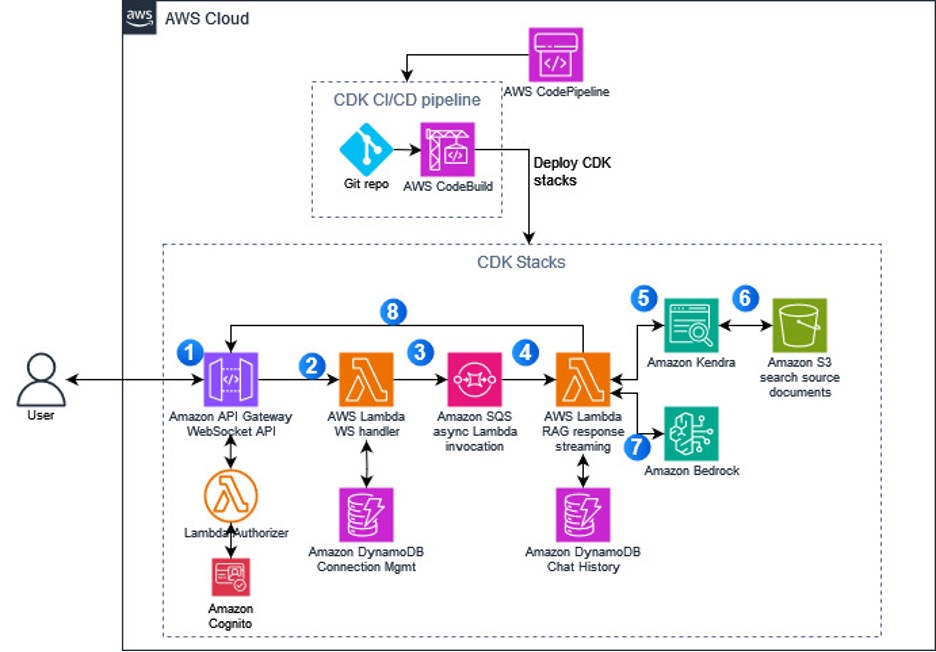

# Enhance the customer experience with an integrated AI chatbot

This repository contains the backend code for deploying a Retrieval-Augmented Generation (RAG) chatbot that leverages Amazon Kendra as the data source, the Bedrock model for the Large Language Model (LLM), and Amazon DynamoDB for storing chat history.

## Overview

The RAG chatbot combines the power of a retrieval system (Kendra) and a generative language model (Bedrock) to provide informative and contextual responses. The chatbot retrieves relevant information from the data source (Kendra) based on the user's query, and then uses the Bedrock model to generate a natural language response incorporating the retrieved information.

The chat history is stored in a DynamoDB table, to allow the LLM to generate contextual responses when the user asks new questions.

## Architecture



The application follows a serverless architecture, leveraging various AWS services:

**Amazon API Gateway**: Provides a secure and scalable API endpoint for the chatbot.  
**AWS Lambda**: Serverless compute service for running the application logic.  
**Amazon S3 Bucket**: A managed service for storing relevant documents that the chatbot can refer to.  
**Amazon Kendra**: A highly accurate and easy-to-use enterprise search service that indexes data from an S3 bucket and provides relevant search results.  
**Amazon Bedrock Model**: A state-of-the-art language model developed by Anthropic, used for generating natural language responses.  
**Amazon DynamoDB**: A fully managed NoSQL database service used for storing chat history.  

## Getting Started

To get started with the RAG chatbot, follow these steps:

### Prerequisites:

AWS account with appropriate permissions.  
Node.js and npm installed.  
AWS CLI configured with your credentials.  

### Installation:

Clone this repository and navigate to the project directory

Install the AWS CDK CLI: `npm install -g aws-cdk`  
Install dependencies: run `npm install`

### Configuration:

Be ready with the parameter values of ProjectName, BedrockModelId, and BedrockModelRegion.

### Deployment:

Deploy the application using the AWS Cloud Development Kit (CDK).

Bootstrap your environment: `cdk bootstrap`  
Deploy your cdk application:  
``` 
cdk deploy --all --context projectName=${projectName} \
--context modelId=${modelId} --context modelRegion=${modelRegion}`
```

## Usage:

Find the ARN/Logical ID of the deployed resources from the **Outputs** section or the **Resources** section of the RagBlogCdkStack stack.  
You can then upload relevant documents for your use case in the S3 DataSourceBucket.

To sync your kendra index with this data, run the following command using your saved Amazon S3 connector ID, Amazon Kendra index ID, and AWS Region.
```
aws kendra start-data-source-sync-job \
--id S3-connector-id \
--index-id kendra-index-id \
--region aws-region
```

You can then interact with the chatbot by sending requests to the API Gateway endpoint through an authorized user.  
The chatbot will retrieve relevant information from Kendra, generate a response using the Bedrock model, and send it back through the API gateway.

Please refer this Blog for further clarity: **Insert Blog link**

## Clean Up

Go to the CloudFormation console in your AWS Account and delete the RagBlogCdkStack. If needed, delete the CDKToolkit stack as well.